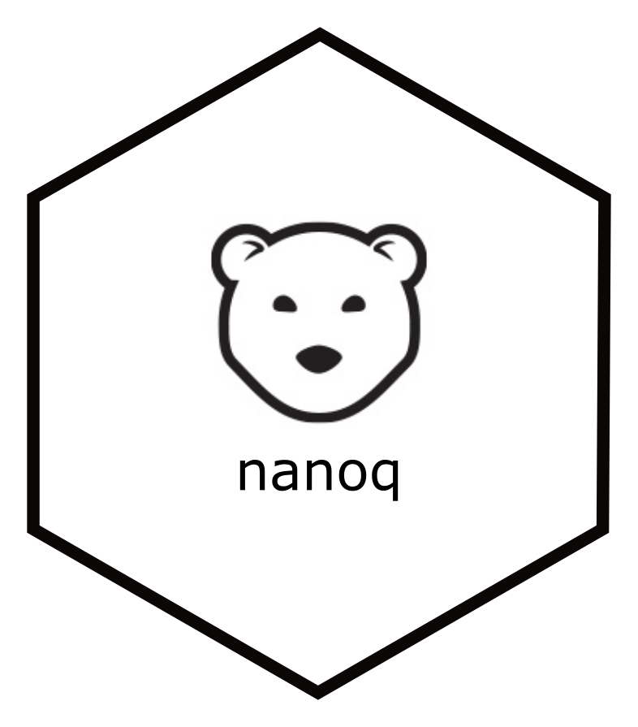

# nanoq <a href='https://github.com/esteinig'></a>


[](https://doi.org/10.5281/zenodo.3707754)

Minimal but speedy quality control for nanopore reads.

## Overview

**`v0.2.1`**

- [Purpose](#purpose)
- [Install](#install)
- [Usage](#usage)
  - [Command line](#command-line)
  - [Parameters](#parameters)
  - [Output](#output)
- [Benchmarks](#benchmarks)
- [Dependencies](#dependencies)
- [Etymology](#etymology)
- [Citing](#citing)

## Purpose

Basic sequence quality control and computation of summary statistics can be a bit slow due to bottlenecks in read parsing. `Nanoq` attempts to perform these operations on `fastx` files using the `needletail` and `rust-bio` libraries with either a single-pass operation for defaulty summary statistics and filtering, or a two-pass operation enabling filtering methods similar to [`Filtlong`](https://github.com/rrwick/Filtlong).

Quality scores are computed for basecalls from nanopore sequencing data, as outlined in the [technical documentation](https://community.nanoporetech.com/technical_documents/data-analysis/).

## Install

### `Cargo`

If you have [`Rust`](https://www.rust-lang.org/tools/install) and `Cargo` installed:

```
cargo install nanoq
```

#### `Conda`

Currently on this channel but will be in `BioConda`:

```
conda install -c conda-forge -c esteinig nanoq=0.2.1
```

#### `Docker`

`Docker` container is based on the light `Alpine` OS (~ 20 MB container size)

```
docker pull esteinig/nanoq:latest
```

#### `Singularity`

```
singularity pull docker://esteinig/nanoq:latest
```

## Usage

Tests can be run within the `nanoq` repository:

```
cargo test
```

`Nanoq` accepts a file or stream of sequence reads in `fast{a/q}` and compressed formats on `stdin`:

```bash
cat test.fq | nanoq
```

Reads filtered by minimum read length (`--length`) and mean read quality (`--quality`) are output to `stdout`:

```bash
cat test.fq | nanoq -l 1000 -q 10 > reads.fq 
```

Extended two-pass filtering analogous to `Filtlong` removes the worst 20% of bases using sorted reads by quality (`--keep_percent`) or the worst quality reads until approximately 500 Mbp remain (`--keep_bases`): 

```bash
nanoq -f test.fq -p 80 -b 500000000  > reads.fq 
```

Live sequencing run data directory:

```bash
RUN=/data/nanopore/run
```

Check total run statistics of active run:

```bash
find $RUN -name *.fastq -print0 | xargs -0 cat | nanoq
```

Check per-barcode statistics of active run:

```bash
for i in {01..12}; do
  find $RUN -name barcode${i}.fastq -print0 | xargs -0 cat | nanoq
done
```

### Parameters

```
nanoq 0.2.1

Fast quality control and summary statistics for nanopore reads

USAGE:
    nanoq [FLAGS] [OPTIONS]

FLAGS:
    -c, --crab       Rust-Bio parser (fastq only) [false]
    -d, --detail     Print detailed read summary [false]
    -h, --help       Prints help information
    -V, --version    Prints version information

OPTIONS:
    -f, --fastx <FASTX>             Fastx input file [-]
    -o, --output <OUTPUT>           Fastx output file [-]
    -m, --max_length <MAXLEN>       Maximum sequence length [0]
    -l, --min_length <MINLEN>       Minimum sequence length [0]
    -q, --min_quality <QUALITY>     Minimum average sequence quality [0]
    -b, --keep_bases <BASES>        Keep reads with best quality number of bases [0]
    -p, --keep_percent <PERCENT>    Keep best percent quality bases on reads [0]
    -t, --top <TOP>                 Print <top> length + quality reads [5]
```

### Output

Basic summary statistics are output to `stderr`: 

```bash
100000 400398234 5154 44888 5 4003 3256 8.90 9.49
```

* number of reads
* number of base pairs
* N50 read length
* longest and shorted reads
* mean and median read length
* mean and median read quality 

Extended output analogous to `NanoStat` can be obtained using multiple `--detail` flags:

```bash
cat test.fq | nanoq -d -d -d
```

```
Nanoq Read Summary
====================

Number of reads:      100,000
Number of bases:      400,398,234
N50 read length:      5,154
Longest read:         44,888
Shortest read:        5
Mean read length:     4,003
Median read length:   3,256
Mean read quality:    8.90
Median read quality:  9.49

Mean read quality thresholds (Q)

>10: 27,409 (27.41%) 121,046,940
>7 : 86,891 (86.89%) 360,326,143
>5 : 94,180 (94.18%) 387,336,238

Mean read length thresholds (bp)

>30,000   : 47 (0.05%) 1,555,019
>10,000   : 4,987 (4.99%) 71,601,161
>5,000    : 25,515 (25.52%) 207,924,723
>1,000    : 90,837 (90.84%) 395,158,043
>500      : 96,406 (96.41%) 399,281,265
>200      : 99,104 (99.10%) 400,340,531

Top ranking read lengths (bp)

1. 44,888
2. 40,044
3. 37,441
4. 36,543
5. 35,630

Top ranking mean read qualities (Q)

1. 12.07
2. 11.92
3. 11.87
4. 11.87
5. 11.86
```

## Benchmarks

Benchmarks evaluate processing speed of a long-read filter and computation of summary statistics on the first 100,000 reads (`test.fq.gz` in Docker Benchmark image) of the even [Zymo mock community](https://github.com/LomanLab/mockcommunity) (`GridION`) using the `nanoq:v0.2.0` [`Benchmark`](paper/Benchmarks) image with comparison to [`NanoFilt`](https://github.com/wdecoster/nanofilt), [`NanoStat`](https://github.com/wdecoster/nanostat) and [`Filtlong`](https://github.com/rrwick/Filtlong)


| program         | ftype  |task   | mean sec (+/- sd)   |  ~ reads / sec  | speedup |
| -------------   | -------|-------|---------------------|-----------------|---------|
| nanofilt        | fq     |filter | 35.25 (0.35)        | 2,836           | 1.00 x  |
| filtlong        | fq     |filter | 16.71 (0.47)        | 5,984           | 2.11 x  |
| nanoq           | fq     |filter | 03.63 (0.45)        | 27,548          | 9.71 x  |
| nanostat        | fq     |stats  | 37.39 (0.50)        | 2,674           | 1.00 x  |
| nanoq           | fq     |stats  | 03.57 (0.57)        | 28,011          | 10.4 x  |
| nanofilt        | fq.gz  |filter | 35.58 (0.36)        | 2,810           | 1.00 x  |
| filtlong        | fq.gz  |filter | 23.84 (0.60)        | 4,195           | 1.49 x  |
| nanoq           | fq.gz  |filter | 06.37 (0.41)        | 14,858          | 5.28 x  |
| nanostat        | fq.gz  |stats  | 42.21 (0.37)        | 2,369           | 1.00 x  |
| nanoq           | fq.gz  |stats  | 06.30 (0.28)        | 15,873          | 6.70 x  |


## Dependencies

`Nanoq` uses [`rust-bio`](https://rust-bio.github.io/) which has a ton of great contributors and the [`needletail`](https://github.com/onecodex/needletail) library from OneCodex. 

## Etymology

Avoided name collision with `nanoqc` and dropped the `c` to arrive at `nanoq` [nanɔq] which coincidentally means 'polar bear' in Native American ([Eskimo-Aleut](https://en.wikipedia.org/wiki/Eskimo%E2%80%93Aleut_languages), Greenlandic). If you find `nanoq` useful for your research consider a small donation to the [Polar Bear Fund](https://www.polarbearfund.ca/) or [Polar Bears International](https://polarbearsinternational.org/)

## Contributions

We welcome any and all suggestions or pull requests. Please feel free to open an issue in the repositorty on `GitHub`.